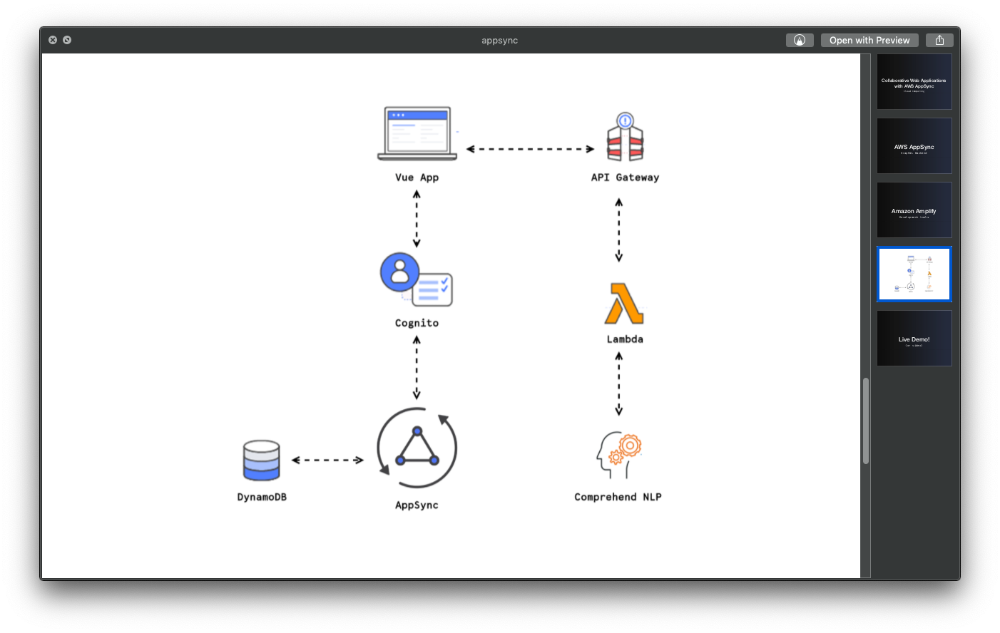
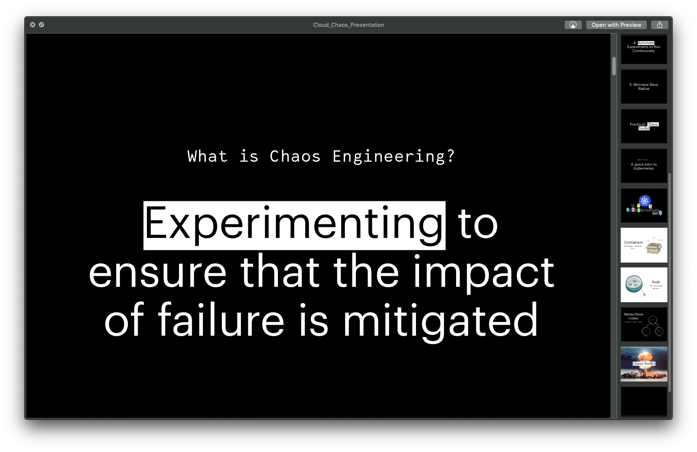
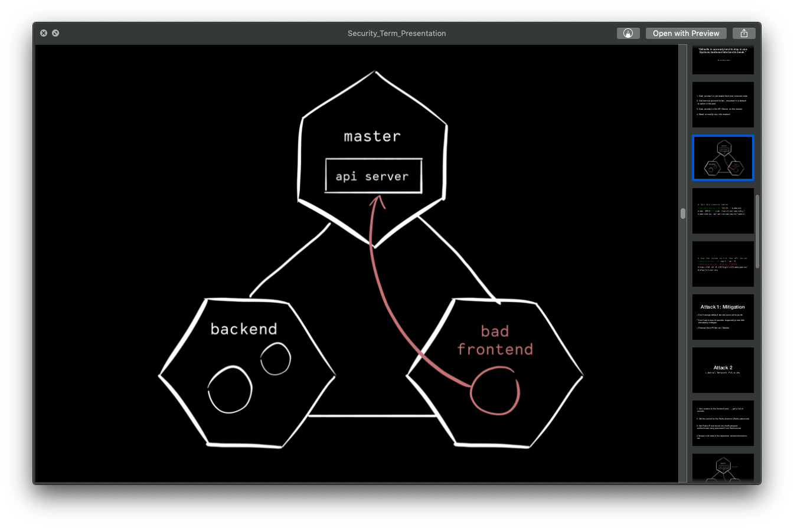
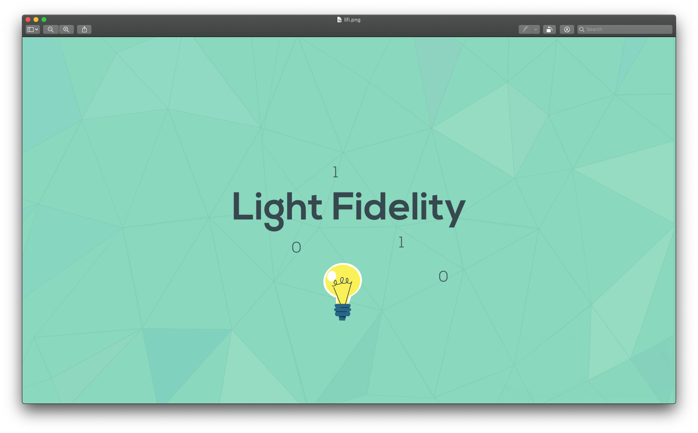
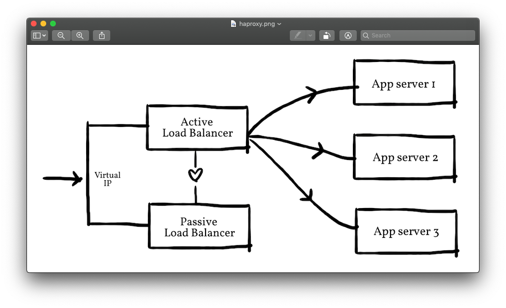

# Cloud Computing Papers

Term papers and lab reports for my Cloud Computing and Cloud Security modules in Applied Computing

## Year 4

### [Collaborative Data Driven Web Applications with Amazon Appsync](<./Year 4/Cloud_Appsync.pdf>)

Cloud computing term paper which explores the use of Amazon Services Appsync and Amplify to create collaborative, GraphQL based web applications

[Corresponding Github Repo](https://github.com/dimitraz/jukebox)

### [Chaos Engineering and Automating chaos](<./Year 4/Cloud_Chaos.pdf>)

Cloud Computing term paper which explores the fairly new discipline of Chaos Engineering and automating chaos using Chaos Toolkit within a Kubernetes cluster on GCP

[Corresponding Slide deck](<./Year 4/Cloud_Chaos_Presentation.pdf>)

### [Exploring Kubernetes Security](<./Year 4/Security_Term_Paper.pdf>)

Network security term paper which explores various security vulnerabilities in On-Prem Kubernetes applications

[Corresponding Slide deck](<./Year 4/Security_Term_Presentation.pdf>)

### [Containerisation with Docker](<./Year 4/Cloud_Docker.pdf>)

Lab report for containerising a RabbitMQ application with Docker and managing it with AWS ECS

### [Exploring HAProxy and Varnish Cache](<./Year 4/Cloud_Varnish.pdf>)

Lab report for configuring a reverse proxy with caching using HAProxy and Varnish

### [Infrastructure automation and configuration with Ansible and Terraform](<./Year 4/Cloud_Ansible_Terraform.pdf>)

Automating the creation of an AWS VPC with various EC2 instances through Terraform and configuring the servers with Ansible

### [Openflow Firewall](<./Year 4/Cloud_Openflow_Firewall.pdf>)

Creating an Openflow Firewall controller in Python using POX

## Year 3

### [Light Fidelity](<./Year 3/Li_fi.pdf>)

Research paper on Visible Light Communication and CSK Modulation

[Corresponding "educational animation"](https://www.youtube.com/watch?v=fTRp8kpO-K4)

## Year 2

### [High Availability with HAProxy and Keepalived](<./Year 2/Cloud_HA.pdf>)

Exploring the concepts of redundancy, reliability and scalability by setting up a high availability load balancing architecture on a cluster of raspberry pis, using HAProxy and Keepalived.

[Corresponding Repo](https://github.com/dimitraz/high-availability-poc)

